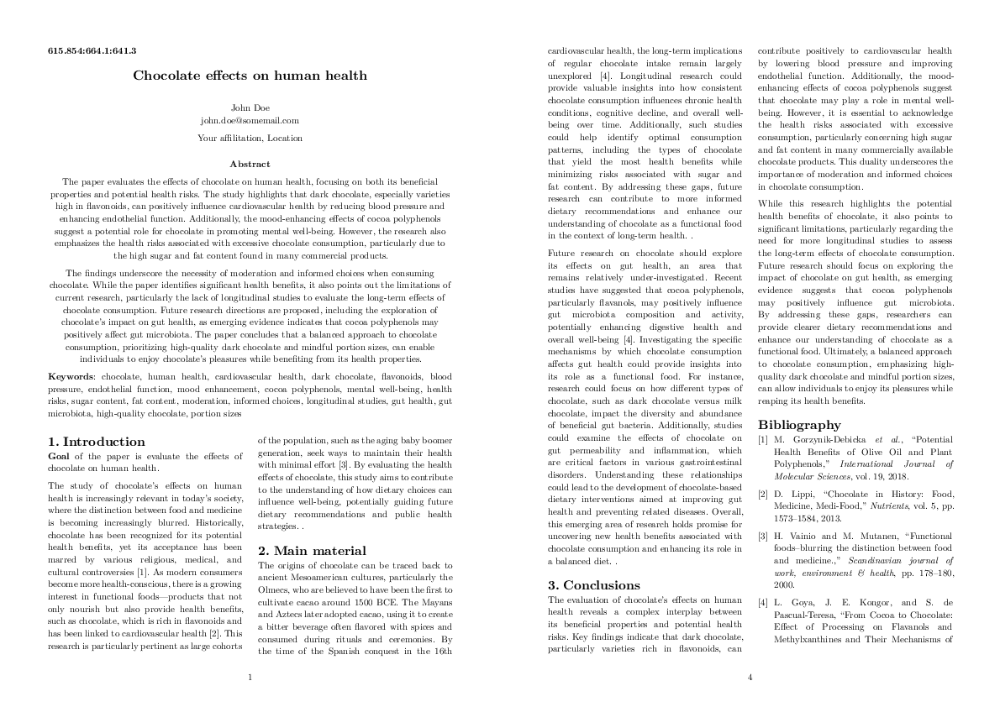
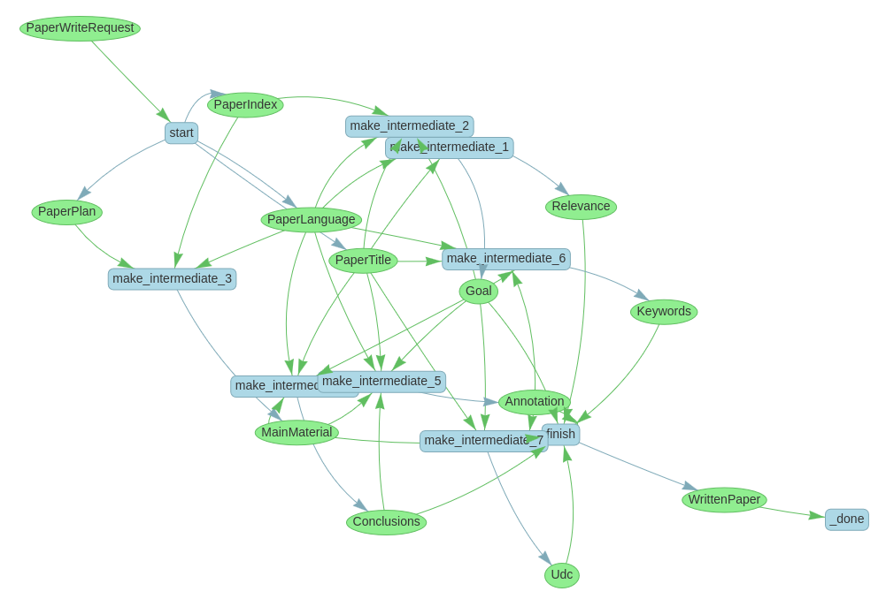

# AI Paper Generator



AI app that generates scientific papers. It automatically searches for relevant literature and uses LLMs.

## Features

- Generates all relevant parts of a paper: abstract, keywords, contents, conclusions, bibliography, etc.
- Utilizes LLM for writing text.
- Searches for relevant literature online.
- Program outputs all relevant information in JSON file, which can be used for programmatical processing.
- You can use Jinja tempates with generated contexts for making anything you want: simple text paper, LaTeX, Typst, or more!

## How to Run this Project?

Store your OpenAI API key as an environmental variable:

```sh
export OPENAI_API_KEY=sk-******
```

THen, use [`uv`](https://github.com/astral-sh/uv):

```python
uv run main.py
```

### CLI Usage

```plain
Usage: main.py [OPTIONS] COMMAND [ARGS]...

Options:
  --help  Show this message and exit.

Commands:
  continue-checkpoint
  fill-template        Use Jinja templates to fill a context generated...
  generate-paper       Generate paper using the title.
  show-workflow-map    Visualize the internal workflow in images.
```

Paper generation:

```plain
Usage: main.py generate-paper [OPTIONS] TITLE LANGUAGE OUTPUT

  Generate paper using the title.

  Outputs JSON context.

Options:
  --templates-dir DIRECTORY  Directory for LLM message templates  [required]
  --llm-model TEXT           LLM model (currently, only OpenAI models are
                             supported)
  --embedding-model TEXT     LLM model (currently, only OpenAI models are
                             supported)
  --checkpoints-file PATH    Checkpoints file (will be overwritten).
  --help                     Show this message and exit.
```

Continue from checkpoint (in case `generate-paper` interrupted):

```plain
Usage: main.py continue-checkpoint [OPTIONS] [CHECKPOINTS_FILE] OUTPUT

Options:
  --templates-dir DIRECTORY  Directory for LLM message templates  [required]
  --llm-model TEXT           LLM model (currently, only OpenAI models are
                             supported)
  --embedding-model TEXT     LLM model (currently, only OpenAI models are
                             supported)
  --help                     Show this message and exit.
```

Fill Jinja template:

```plain
Usage: main.py fill-template [OPTIONS] CONTEXT TEMPLATE OUTPUT_PAPER
                             OUTPUT_BIBLIOGRAPHY

  Use Jinja templates to fill a context generated from `generate-paper`.

  `template` can be a directory of templates (root template must be
  `root.jinja`). It can be a file also.

Options:
  --help  Show this message and exit.
```

And, cherry on pie, visualize internal workflows:

```plain
Usage: main.py show-workflow-map [OPTIONS] OUTPUT_DIR

  Visualize the internal workflow in images.

Options:
  --help  Show this message and exit.
```

## How this Project is Implemented?

Diagram of the most complex algorithm:



*If you are thinking, what's `intermediate` mean, don't mind, this is some [problem with LlamaIndex](https://github.com/run-llama/llama_index/issues/18337).*

Tech stack:
- Python
- OpenAI API
- OpenAI's GPT and embedding models
- Semantic Scholar API (for paper search)
- LlamaIndex
- *Especially* - LlamaIndex Workflow
